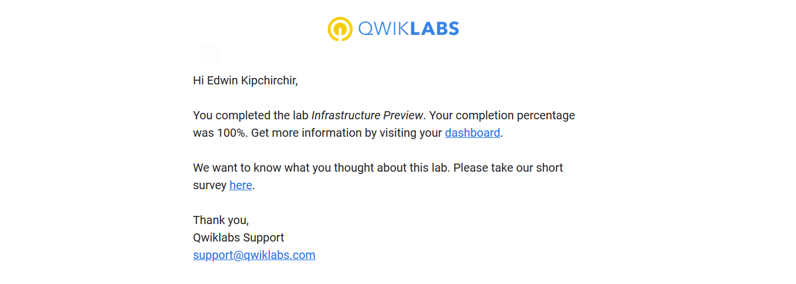
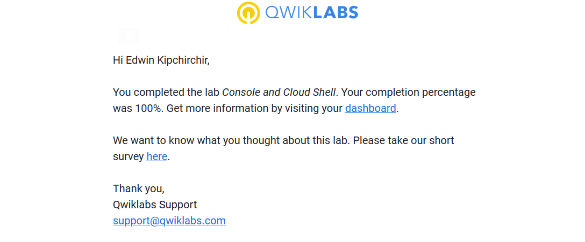
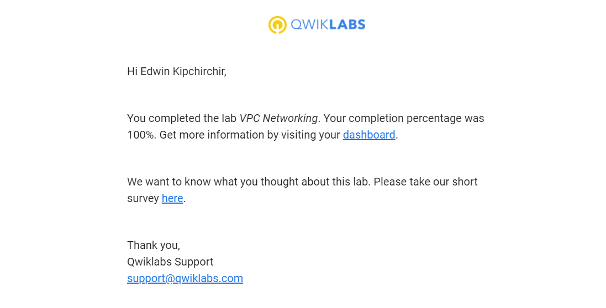
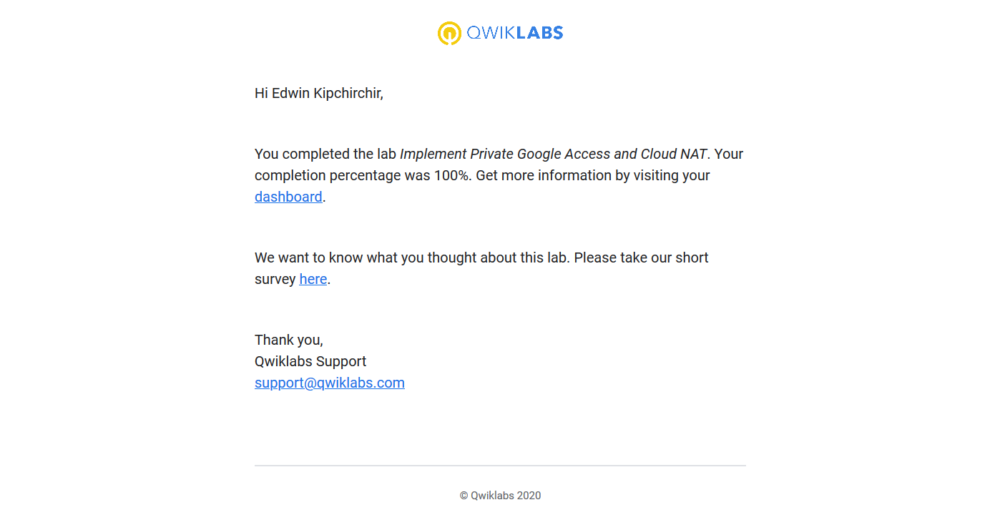
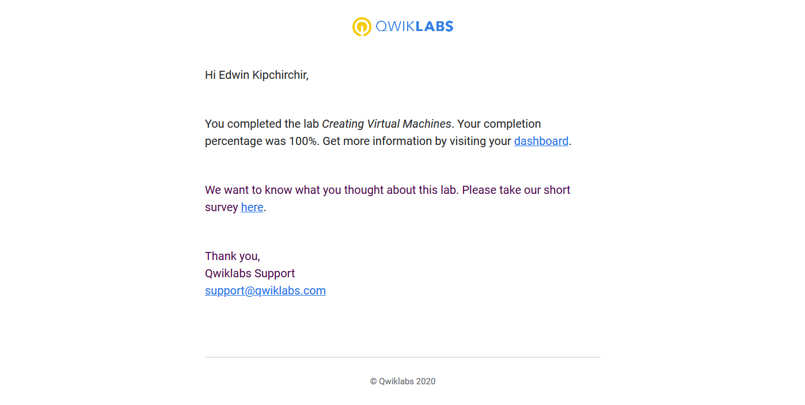
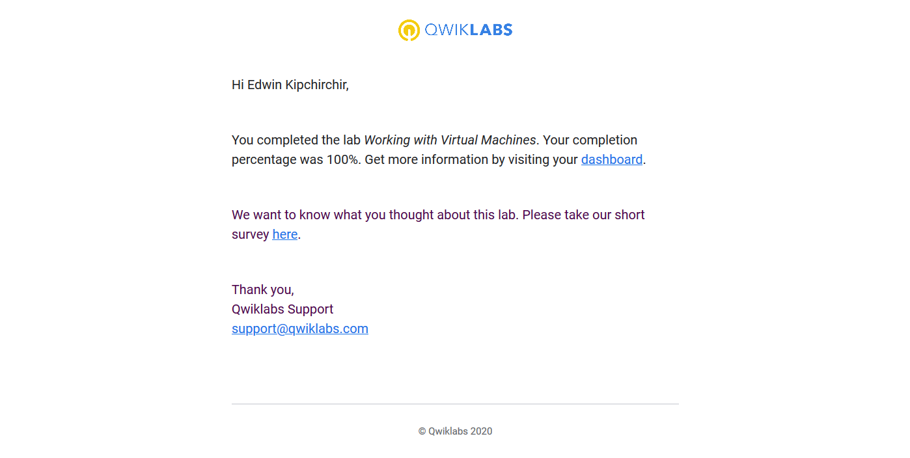
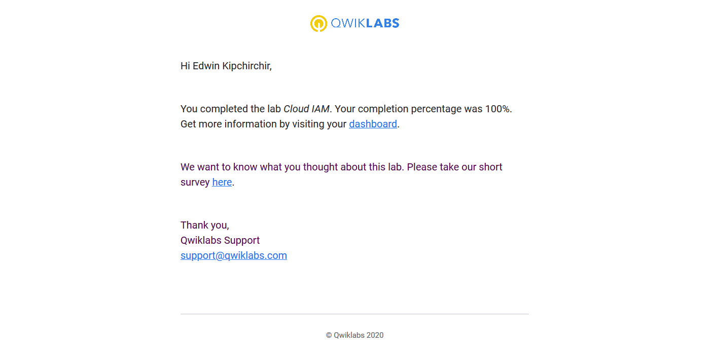
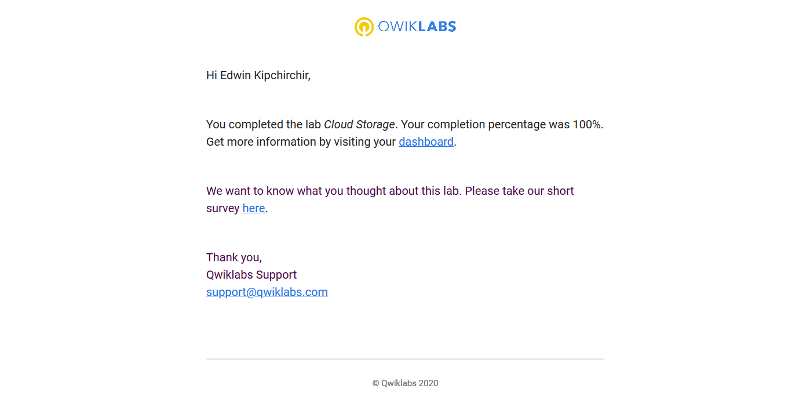
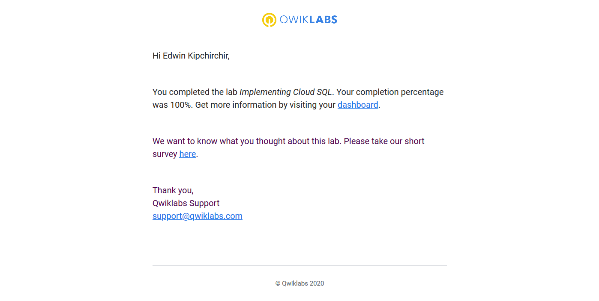
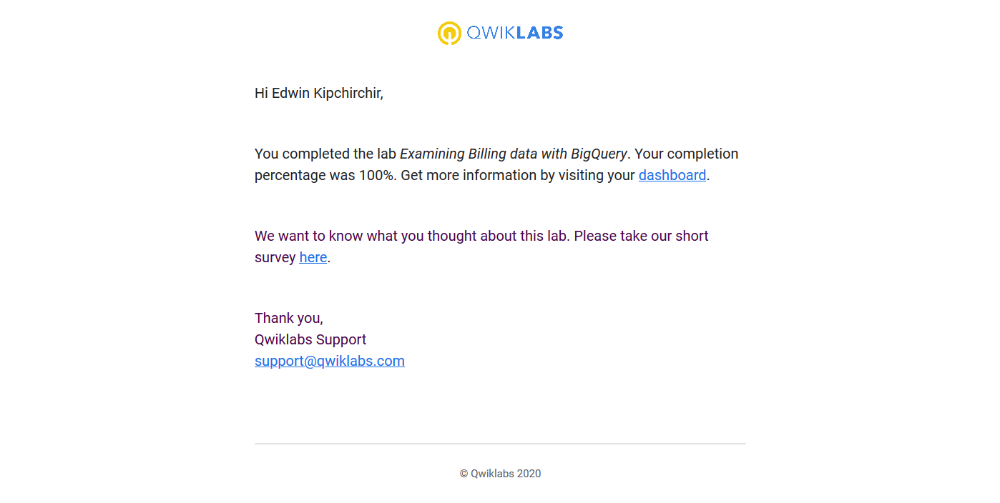

# GCP Practice Project

## Infrastracture Preview

## Console and Cloud Shell

## VPC networking

## Implementing Private Google access and Cloud NAT

## Creating Virtual Machines

## Working with VMs

## Cloud IAM

## Cloud Storage

## Implementing Cloud SQL

## Examining Billing data with BigQuery
 